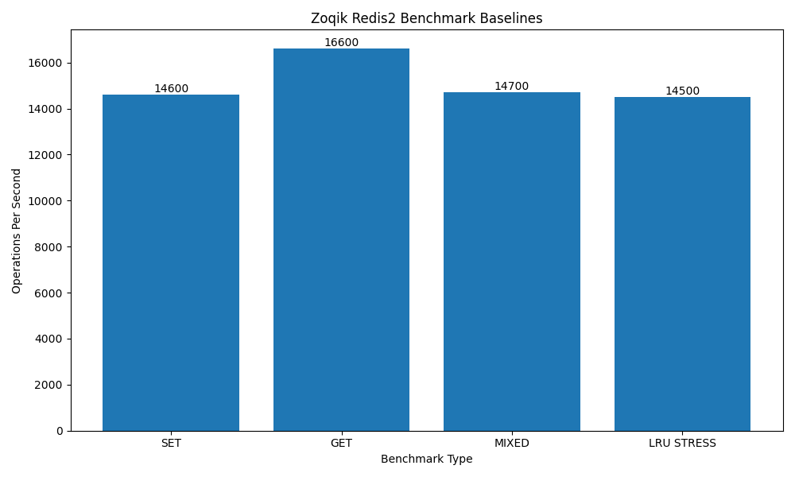

# Zoqik Redis

A Redis-inspired in-memory database server built from scratch in C++ using raw TCP sockets and custom protocol parsing.

The project focuses on learning and implementing low-level systems concepts including:
- TCP networking
- stream parsing
- storage engine design
- TTL expiration
- LRU cache eviction
- memory ownership
- benchmarking and performance analysis

---

# Features

## Networking
- TCP server using Winsock
- blocking socket architecture
- incremental stream parsing
- partial send handling
- client connection lifecycle management

## Protocol Layer
- custom newline-delimited protocol
- tokenizer and command parser
- case-insensitive commands
- structured error handling

Supported commands:

```bash
SET key value
GET key
DEL key
PING

SET key value EX ttl
```

---

# Storage Engine

The storage layer is implemented using:

- `unordered_map` for O(1) key lookup
- doubly linked list for O(1) LRU operations

Implemented features:
- persistent key-value storage
- TTL expiration
- lazy expiration cleanup
- LRU eviction policy
- MRU/LRU cache ordering
- memory-safe node cleanup
- cache observability utilities

---

# LRU Cache Design

Cache ordering semantics:

```text
head -> Most Recently Used (MRU)
tail -> Least Recently Used (LRU)
```

Implemented operations:
- O(1) insert
- O(1) remove
- O(1) move-to-front
- O(1) eviction

---

# Project Structure

```text
src/
│
├── core/
│   └── command_handler
│
├── network/
│   └── tcp server
│
├── protocol/
│   └── parser/tokenizer
│
├── storage/
│   └── database engine
│
└── main.cpp

benchmarks/
│
├── python/
│   └── benchmark scripts
│
└── results/
    └── benchmark baselines
```

---

# Build

## Windows (MinGW)

```bash
g++ main.cpp protocol/*.cpp network/*.cpp storage/*.cpp core/*.cpp -o redis_server -lws2_32
```

Run:

```bash
./redis_server
```

---

# Example Usage

```text
SET name Aaditya
GET name

SET session abc EX 10

PING
```

---

# Benchmarking

Benchmarks are executed using custom Python socket clients.

Measured workloads:
- SET throughput
- GET throughput
- mixed workloads
- LRU eviction stress

Benchmark methodology:
- localhost TCP connection
- single-threaded server
- blocking sockets
- synchronous request/response
- Python `time.perf_counter()` timing

---

# Current Benchmark Baselines

| Benchmark | Workload | Throughput |
|---|---|---|
| SET | 100k sequential SET operations | ~14.6k ops/sec |
| GET | 100k sequential GET operations | ~16.5k ops/sec |
| MIXED | 70% GET / 30% SET | ~14.7k ops/sec |
| LRU STRESS | continuous eviction pressure | ~14.5k ops/sec |


---

# Benchmark Observations

- GET operations outperform SET operations as expected.
- LRU eviction overhead remains relatively small compared to overall request cost.
- Current bottlenecks are likely dominated by:
  - socket syscall overhead
  - synchronous request/response flow
  - parser/string handling
  - allocation overhead

Benchmark variance remains low across runs, indicating stable runtime behavior.

---

# Example Benchmark Results

## SET Benchmark

```text
Total Operations : 100000
Total Time       : 6.83 sec
Throughput       : 14600 ops/sec
```

## GET Benchmark

```text
Total Operations : 100000
Total Time       : 6.03 sec
Throughput       : 16600 ops/sec
```

---

# Current Roadmap

## Completed
- TCP server
- custom protocol parser
- TTL expiration
- LRU cache eviction
- benchmark tooling
- memory ownership cleanup

## Planned

1. RESP protocol support
2. persistence layer
3. redis-benchmark compatibility
4. concurrent clients
5. epoll/select networking
6. pipelining
7. thread safety

---

# Engineering Goals

This project is primarily focused on:
- systems programming fundamentals
- storage engine internals
- protocol design
- performance analysis
- low-level debugging
- backend systems architecture

---

# Future Benchmark Goals

Planned experiments:
- RESP protocol benchmarks
- concurrent client benchmarks
- pipelining throughput
- epoll/select scalability
- allocator experiments
- eviction stress analysis
- TTL-heavy workloads

---

# License

MIT